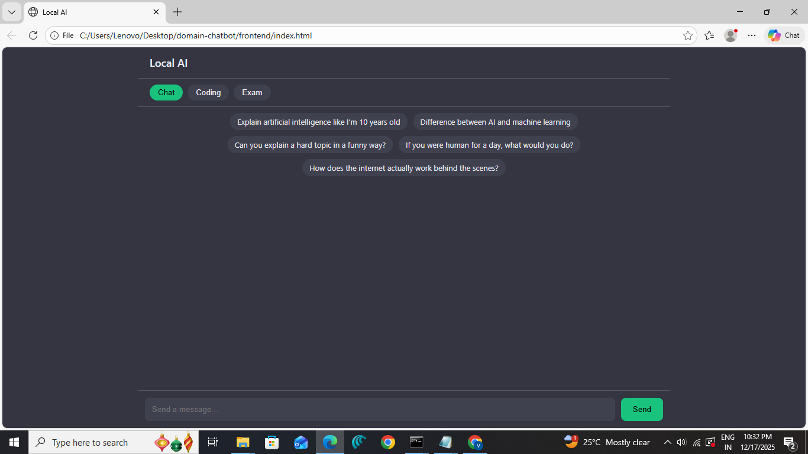
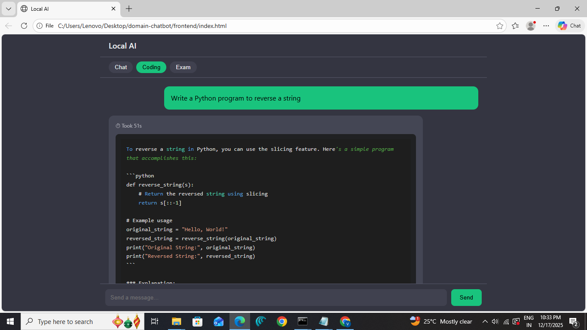
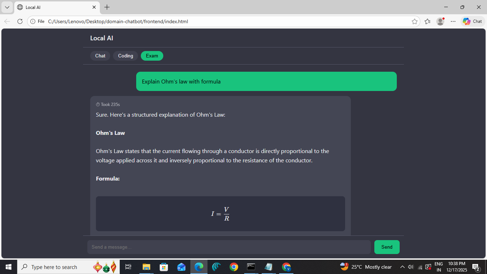

# 🤖 Domain-Chatbot  
### A Local Domain-Based AI Chatbot  
**Developer:** Valtry

---

## 📌 Overview

**Domain-Chatbot** is a **fully local, domain-aware AI chatbot** that changes its behavior based on the selected domain:

- 💬 **Chat** → Friendly, casual conversations  
- 💻 **Coding** → Programming help with syntax highlighting  
- 📚 **Exam** → Exam-oriented answers with structured points and formulas  

The project runs **100% offline**, uses **Ollama for local LLMs**, and supports **real-time streaming**, **KaTeX math rendering**, and **code highlighting** — all without any API keys.

---

## ✨ Why Domain-Chatbot?

Most chatbots treat every question the same.

**Domain-Chatbot doesn’t.**

- 💬 Chat mode → friendly, human-like conversation  
- 💻 Coding mode → clean code + syntax highlighting  
- 📘 Exam mode → structured answers + KaTeX formulas  

All of this runs **locally** — no API keys, no internet dependency.

---

## 🖼️ Screenshots

### 💬 Chat Domain

### 💻 Coding Domain

### 📘 Exam Domain (KaTeX formulas)

---

## 🧪 Example Prompts

### Chat
> Explain black holes like I'm 10

### Coding
> Write a Python program to check palindrome

### Exam
> Derive Ohm’s law and explain with formula

---

## ✨ Key Features

- 🔁 **Real-time streaming responses**
- 🧠 **Domain-based AI behavior**
- 🧮 **Automatic KaTeX rendering for formulas**
- 🖍️ **Syntax highlighting for code**
- 💡 **Centered suggestion prompts (one-time per domain)**
- 🔒 **Fully offline & privacy-friendly**
- ⚡ Lightweight frontend (no frameworks)

---

## 🧠 Domain Behavior

| Domain | Behavior | Special Handling |
|------|--------|------------------|
| Chat | Friendly & conversational | Natural responses |
| Coding | Developer-focused | Highlight.js for code |
| Exam | Exam-oriented | KaTeX for formulas |

---

## 🏗️ Architecture

Frontend (HTML + JS)
        ↓
 FastAPI Backend
        ↓
 Ollama Models (Local)

---

## 🧮 Smart Formula Detection (KaTeX Logic)

The chatbot intelligently decides what should be rendered as math.

### Rules:
- Text inside `** **` **with math symbols** (`= + - * / ^`) → **KaTeX**
- Text inside `** **` **without math symbols** → **Bold text**
- Normal text remains unchanged

### Examples: R = V / I          → Rendered using KaTeX Resistance        → Bold text Explanation:      → Bold text (not KaTeX)

This prevents normal headings or explanations from being mistakenly rendered as math.

---

## 🛠️ Tech Stack

### Backend
- Python 3.9+
- FastAPI
- Uvicorn
- Requests
- Ollama (Local LLM runtime)

### Frontend
- HTML
- CSS
- JavaScript
- KaTeX (Math rendering)
- Highlight.js (Code highlighting)

### AI Models (via Ollama)
- `qwen2.5:0.5b` → Chat
- `qwen2.5-coder:0.5b` → Coding
- `gemma:2b` → Exam

---

## 📂 Project Structure
Domain-Chatbot/ ├── backend/ │   ├── main.py │   ├── router.py │ ├── frontend/ │   ├── index.html │ ├── README.md

---

## ⚙️ Installation & Setup

### 1️⃣ Install Ollama
Download from: https://ollama.com

## Pull required models:

ollama pull qwen2.5:0.5b
ollama pull qwen2.5-coder:0.5b
ollama pull gemma:2b

Start Ollama:

ollama serve

Install dependencies:

pip install fastapi uvicorn requests

Run the backend:

uvicorn main:app --reload

Backend URL:

http://127.0.0.1:8000

Frontend Setup

Open frontend/index.html directly in your browser
OR
Serve it using any static server
No build tools required.

---

## How to Use

1.Select a domain (Chat / Coding / Exam)
2.Use the centered suggestion prompts (shown once per domain)
3.Type or modify a prompt
4.Click Send
5.Watch the response stream live

---

## 👨‍💻 Developer
Valtry
Built with curiosity, logic, and a focus on clean AI UX.

---

## ⭐ Support

If you found this project useful:
- ⭐ Star the repo
- 🍴 Fork it
- 🧠 Experiment with new domains

Your support really helps!

---

## Final Words
This project is more than a chatbot — it’s a mini AI platform that demonstrates:
Local LLM usage
Streaming responses
Smart content parsing
Clean UI behavior
Feel free to fork, extend, and improve 🚀

---

## 🔮 Roadmap

- [ ] Voice input/output
- [ ] Mobile-friendly UI
- [ ] More domains (Medical, Legal, Interview)
- [ ] Model selector UI

---
